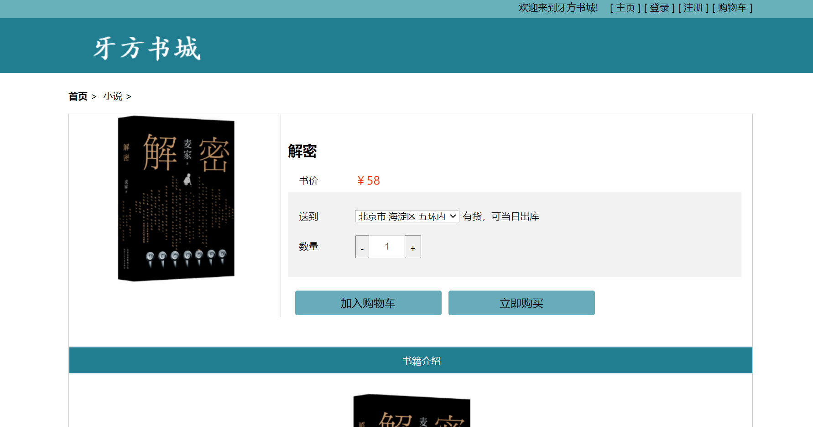
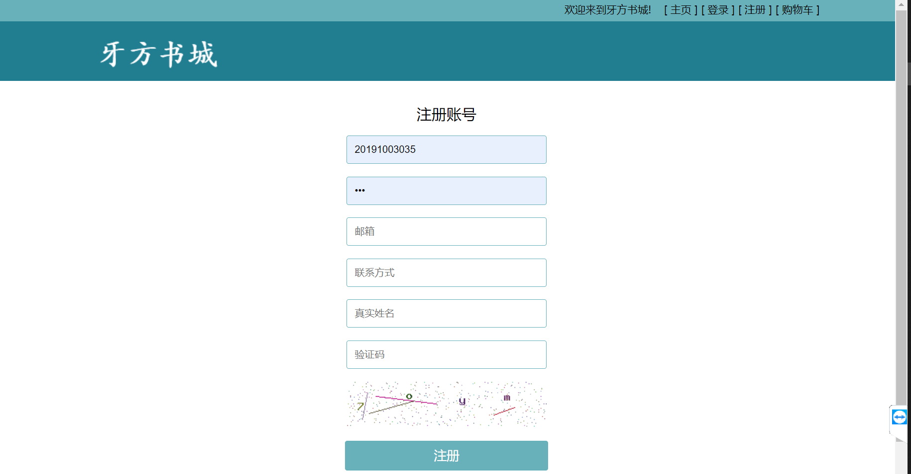

#  YFBookStore

牙方书城，是一个使用 PHP 编写的网上书城程序。

## 已实现功能

- 登录、注册
- 邮箱验证
- 添加书籍并设置封面
- 查看书籍信息

## 部署方法

1. 安装配置好 XAMPP 。
2. 导入 `winter.sql` 到 MySQL 中，确保数据库的名称为 `winter` 。
3. 复制 `conn.example.php` 文件，并重新命名为 `conn.php` 。
4. 修改 `conn.php` 中的数据库用户名和密码。
5. 打开 `RegisterLogin` 文件夹，复制 `findS.example.php` 文件，并重新命名为 `findS.php` 。
6. 修改 `findS.php` 中的 72，73，76，78 ，填入自己的邮箱地址和密码（注：要确保邮箱已开启 SMTP 服务）。
7. 启动 XAMPP 服务，打开 `http://localhost/winter/` 即可看到网站首页。

## 程序截图

